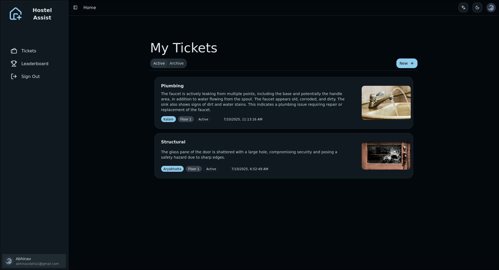
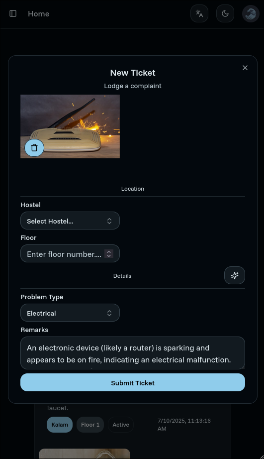
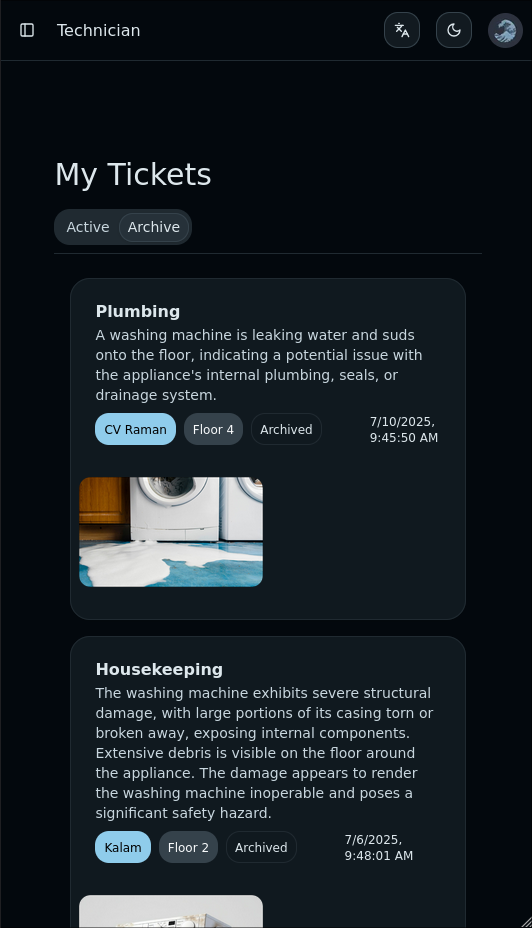
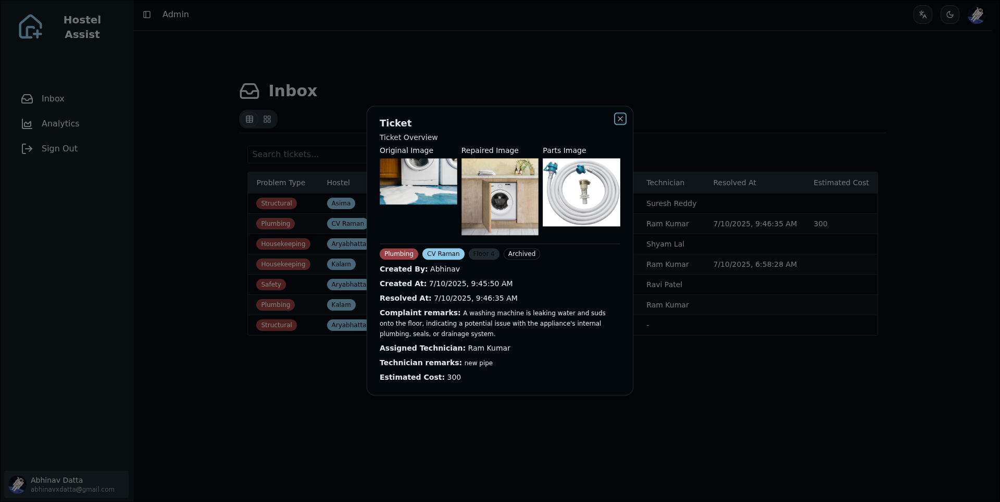

# Hostel Assist

An agentic grievance redressal platform for analyzing hostel issues, estimating repair costs, and assigning available technicians.

## Overview

Hostel Assist streamlines the maintenance workflow in hostels by leveraging AI to automatically analyze reported issues through image recognition, estimate repair costs, and intelligently assign the right technician (plumber, electrician, or general technician) based on availability and expertise.

## Preview

### User View

### Technician View

### Admin View

## Features

- **Issue Reporting** - Submit maintenance requests with images of the problem
- **AI-Powered Analysis** - Automatic image recognition to identify issue type and severity
- **Cost Estimation** - Intelligent repair cost estimation using multi-modal AI
- **Smart Assignment** - Automatic assignment of available technicians based on skill match
- **Real-time Tracking** - Monitor status of all maintenance requests

## Tech Stack

- **Frontend**: Next.js, React, Tailwind CSS, shadcn/ui
- **Backend**: Firebase (Firestore, Cloud Functions)
- **AI/ML**: LangGraph, Vertex AI (Google Cloud Platform)
- **Infrastructure**: Serverless event-driven architecture

## Architecture

The platform uses an event-driven serverless architecture:

1. **Issue Submission** - Users submit grievances with images via the web interface
2. **Image Analysis** - Cloud Functions trigger AI analysis using Vertex AI
3. **Cost Estimation** - LangGraph agentic workflows process multi-modal inputs
4. **Technician Assignment** - Available technicians are matched based on skill requirements
5. **Notifications** - Real-time updates via Firestore listeners

